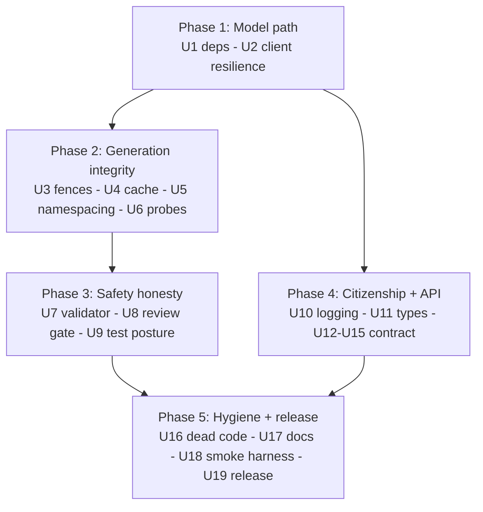
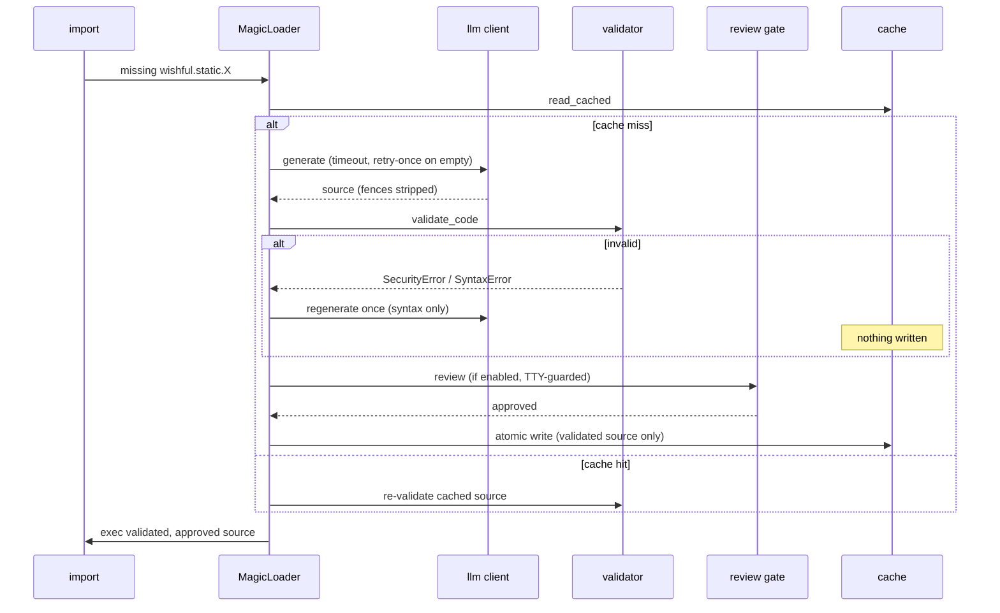

# fix: v0.3.0 release readiness — P0/P1 remediation and quick wins

## Summary

Fix every P0 and P1 finding from the 2026-06-11 whole-codebase review, plus the mechanical quick wins (ruff autofixes, doc drift, dependency refresh, stale artifacts), and ship v0.3.0 behind a new real-model smoke gate with committed proof. A companion plan (`docs/plans/2026-06-11-002-refactor-post-0-3-0-quality-plan.md`) carries everything not release-gating.

## Problem Frame

The review (origin doc) confirmed, with independent validation, that the current `main` is not releasable: the real-model path fails for the configured model (5 of 15 examples fail — 4 with empty LLM content on gpt-5.5, 1 with no valid variants from LLM-as-judge scoring), import-time LLM calls have no timeout, one bad generation permanently poisons the cache, `import wishful` destroys host-app logging, the safety docs overstate what the validator blocks, and the shipped version string is wrong. Every P0/P1 finding was validator-confirmed (27 table findings, consolidated to 20 claims for validation; 20/20 confirmed); smoke proof lives at `docs/reviews/2026-06-11-smoke-proof/`.

---

## Requirements

**Model path**

- R1. No LLM call can hang an import: every litellm call carries a configurable timeout (`WISHFUL_REQUEST_TIMEOUT`, default 300s — sized off the observed latency tail, not the mean). (review #2)
- R2. Empty-content responses are retried once, then fail with a `GenerationError` naming the model and likely cause — never cached, never silent. (review #3)
- R3. Dependencies current: litellm floor `>=1.83.14` with lock on 1.88.x; `pyglove` removed; `nest_asyncio` declared (a provisional bridge — the companion plan removes it with the event-loop redesign); `uv_build` cap lifted to `<1.0.0`; stale floors (rich, ruff) raised; locks refreshed. The mypy 1.18→2.1 portion of #56 is deferred to the companion plan with the full mypy-clean work. (review #10, #22, #23, #55, #56 partial)

**Generation pipeline integrity**

- R4. Standard fenced LLM responses (` ```python `, prose-wrapped, multi-block) parse to clean source — the language tag never reaches `exec`. (review #8)
- R5. Source is validated before it is cached; a failed generation never survives as a cache entry, and the syntax-error regenerate-once retry works with safety ON. (review #4, #7)
- R6. Cache writes are atomic (temp file + rename); empty cached files are treated as cache misses. (review #12)
- R7. `wishful.static.X` and `wishful.dynamic.X` can never address the same cache file; delete/regenerate/review operations are namespace-aware. (review #13)
- R8. Attribute probes (`hasattr`, `getattr` with default, underscore/dunder names) never trigger paid generation for private names and never overwrite a working cache with source lacking the requested symbol. (review #11)

**Safety honesty**

- R9. The validator blocks what the docs say it blocks, in literal/direct form: `__import__`, `importlib`/`builtins`/`ctypes` imports (the latter two added beyond review #1's named set), `__builtins__` subscript, builtins-gadget `getattr`, `globals()`/`vars()`, `compile()`, non-literal `open()` modes, and `os`/`subprocess`/`sys` attribute calls on unbound names — with a negative-test corpus proving it and an `xfail` corpus documenting the aliased-access residual that AST scanning cannot catch. (review #1, extended)
- R10. `review=True` prompts BEFORE any execution on every path (initial import and all regeneration paths) and fails closed without a TTY instead of hanging. (review #5, #6)
- R11. The test suite exercises the import pipeline with safety ON by default; validator coverage ≥90%. (review #14, #15)
- R12. README/AGENTS safety sections describe the actual guarantee: defense-in-depth, not a sandbox. (review #1)

**Host citizenship**

- R13. `import wishful` never removes host loguru sinks and never creates files or directories; file logging is opt-in and degrades gracefully on read-only filesystems. (review #9, P2 #29)

**API contract (the 0.3.0 freeze)**

- R14. `__version__` derives from package metadata and matches pyproject; released as 0.3.0. (review #20)
- R15. `WISHFUL_MODEL` takes precedence over `DEFAULT_MODEL`; env-derived defaults reset consistently. (review #21, P3 #66)
- R16. `evolve()` enforces `timeout_per_variant`; the no-op `verbose` parameter is removed; a fitness exception on the original function is recorded, not crashed on. (review #24, P3 #67)
- R17. A `wishful` console script exists; all CLI commands support `--json` and stable exit codes. (review #25, #27)
- R18. `.env.template` documents every supported environment variable. (review #26)
- R19. All wishful exceptions share a `WishfulError` base; `from wishful import *` does not shadow builtin `type`; `wishful.cache` resolves to the subpackage so `import wishful.cache.manager` works; subpackage `__all__` exports are reachable; `reimport()` is annotated. Full `mypy src/wishful` clean is deferred to the companion plan with mypy 2.x. (P2 #42, #45, #46, P3 #68; #43/#65 deferred)

**Hygiene and docs**

- R20. Dead code removed (`explore/strategies.py`, `ExploreProgressPrinter`); ruff clean. (review #17, #18, P3 #72)
- R21. README, AGENTS.md, and docs-site match reality (counts, trees, deps, env precedence, CLI form, changelog through 0.3.0, evolve documented); no bare `python` commands; stale `coverage.json` removed from the tree. (P2 #57–#60, #41)
- R22. The type registry serializes dataclass `default_factory` fields and parameterized generics correctly. (review #19, P2 #30)

**Release discipline**

- R23. A real-model smoke harness exists (`tests/smoke/`), gated by env + credentials, writing a proof bundle to `docs/proofs/<version>/`. (review #16)
- R24. CI enforces the coverage gate (`fail_under` at the current 78%). (P2 #39)
- R25. v0.3.0 ships only after the full example sweep and smoke harness pass against real gpt-5.5, with proof committed to `docs/proofs/0.3.0/`.

---

## Key Technical Decisions

- **litellm floor `>=1.83.14`, lock 1.88.x**: 1.83.14 is the day-0 gpt-5.5 release with the completion→responses bridge; the floor naturally excludes the quarantined 1.82.7/1.82.8 builds. Client code keeps `completion()`/`acompletion()` — the bridge handles Responses-only models, so no API migration in this plan.
- **Default request timeout 300s** (`WISHFUL_REQUEST_TIMEOUT`): the smoke proof shows multi-call examples running 175–306s wall-clock; per-call latency was never isolated, and U2's retry-once plus U4's syntax-retry mean a single import can chain ~4 sequential calls. R1's goal is bounding litellm's many-minute default hang, which 300s achieves without clipping the slow-but-successful tail into false gate failures. The per-call latency distribution should be extracted from the existing smoke logs during U2 to confirm.
- **Empty-content policy — retry once, then diagnostic failure**: import time is the wrong place for retry loops; one retry covers transience, then `GenerationError` carries model name and a reasoning-model `max_tokens` hint. **The litellm-bump-fixes-empty-content bet is falsified early, not at release** (see U1a): if the bump alone doesn't fix it, the reasoning-model `max_tokens`/`temperature` adjustment (U2) is the in-plan fallback, and the completion→responses migration is the pre-authorized escape hatch — the release gate must not deadlock on an untested bet.
- **Validate-before-cache**: only source that passed the validator is ever written to `.wishful/`; any failure deletes the entry. Closes cache poisoning at the write side while load-side validation stays as the second layer.
- **Cache layout — static stays at `.wishful/<name>.py`, dynamic moves entirely under `.wishful/_dynamic/`**: preserves the documented user-editable static layout; no migration shim (pre-1.0; changelog notes that dynamic caches regenerate).
- **`nest_asyncio` becomes a declared dependency** rather than an error path: notebooks are a core demo audience; the dep is tiny. Replacing the loop-caching design entirely is deferred to the companion plan.
- **Fail-closed review gate**: order becomes validate → review → exec on every path; `review=True` without a TTY raises `ImportError` with guidance (a safety gate must never hang or silently pass).
- **Validator stays defense-in-depth — no sandbox in 0.3.0**: harden the deny-list, prove it with a bypass corpus, and say plainly in docs that in-process execution of LLM code cannot be made safe by AST scanning alone. `getattr` is blocked only for builtins-module targets and forbidden string-literal attributes, to avoid breaking legitimate generated code.
- **`log_to_file` default flips to opt-in (False)**: a library creating directories in CWD at import time is bad citizenship; users who want file logs set `WISHFUL_LOG_TO_FILE=1`. Breaking change, changelogged.
- **`WISHFUL_MODEL` wins over `DEFAULT_MODEL`** (user-confirmed): specific-beats-generic; `DEFAULT_MODEL` remains the fallback so existing `.env` files keep working.
- **Console-script entry point added** (user-confirmed): `wishful = wishful.__main__:main`, making the documented CLI form real.
- **`evolve()`: implement `timeout_per_variant`, remove `verbose`** (user-confirmed): timeout enforcement rides the new request-timeout plumbing plus a bounded executor for user callables; `verbose` returns when there is real progress output to gate.
- **Smoke proof committed under `docs/proofs/<version>/`** (user-confirmed): durable, reviewable, aligned with the casefile direction in STRATEGY.md.
- **Exception base via multiple inheritance**: `GenerationError(WishfulError, ImportError)` and `SecurityError(WishfulError, ImportError)` keep existing `except ImportError` consumers working while giving users one base to catch.

---

## High-Level Technical Design

Phase dependencies — each phase lands independently; the release gate consumes everything:



Corrected generation pipeline (the load-bearing ordering change in U4 + U8):



---

## Implementation Units

### Phase 1 — Make the model path work

### U1. Dependency refresh

- **Goal:** Current, honest dependency manifest; gpt-5.5-capable litellm.
- **Requirements:** R3
- **Dependencies:** none
- **Files:** `pyproject.toml`, `uv.lock`
- **Approach:** litellm `>=1.83.14` + lock 1.88.x; remove `pyglove`; add `nest_asyncio`; `uv_build >=0.11.0,<1.0.0`; rich `>=14.0.0`, ruff `>=0.15.0`; refresh pydantic/dev locks. mypy stays 1.x here (2.x adoption is in the companion plan).
- **Test scenarios:** full suite green after `uv sync`; `uv run python -c "import nest_asyncio"` succeeds; `uv tree` shows no pyglove.
- **Verification:** lock resolves cleanly on a fresh `uv sync`; no import errors across `src/`.

### U1a. Empty-content falsification gate

- **Goal:** Prove or kill the load-bearing bet (litellm bump fixes empty content) before investing in Phases 2–5.
- **Requirements:** R2
- **Dependencies:** U1
- **Files:** none (experiment + decision record)
- **Approach:** immediately after U1, re-run the five examples that failed the review smoke run (00, 08, 09, 10, 13) against real gpt-5.5. Record per-call latency and outcome. Decide: (a) bump alone fixes the 4 empty-content failures → proceed; (b) still empty → the reasoning-model `max_tokens`/`temperature` fallback in U2 becomes required, not optional; (c) example 13 is judge-side, not empty-content (its documented failure is "no valid variants") → either it joins the empty-content cluster or it is removed from U19's hard gate with recorded rationale. This is a one-session falsification test, not a release gate.
- **Test scenarios:** `Test expectation: none -- experiment; the outcome is a recorded decision that shapes U2 and U19.`
- **Verification:** a short decision note (committed alongside the plan or in the changelog draft) states which of (a)/(b)/(c) holds and what U19's example-13 gate criterion is.

### U2. LLM client resilience

- **Goal:** Bounded, diagnosable LLM calls; dynamic fake-mode.
- **Requirements:** R1, R2
- **Dependencies:** U1
- **Files:** `src/wishful/llm/client.py`, `src/wishful/config.py`, `.env.template`, `tests/test_llm.py`, `tests/test_config.py`
- **Approach:** `Settings.request_timeout` (env `WISHFUL_REQUEST_TIMEOUT`, default 300.0; extract the per-call latency distribution from the existing smoke logs to confirm) passed to `completion()`/`acompletion()`; empty-content → one retry → `GenerationError` with model name + reasoning-model hint (if U1a found the bump alone insufficient, also adjust default `max_tokens`/`temperature` for reasoning models here); `_FAKE_MODE` becomes a per-call function reading the env (review P2 #40).
- **Test scenarios:** mock litellm captures `timeout` kwarg on both sync and async paths; empty content twice → `GenerationError` mentioning the model; empty then content → success with exactly 2 calls; `_extract_content` malformed-response and empty-string paths raise `GenerationError` (drop the `pragma: no cover`); `monkeypatch.setenv("WISHFUL_FAKE_LLM", ...)` toggles fake mode without module reload.
- **Verification:** no litellm call site without a timeout (grep); suite green.

### Phase 2 — Generation pipeline integrity

### U3. Fence stripping rewrite

- **Goal:** Standard LLM response shapes parse to clean source.
- **Requirements:** R4
- **Dependencies:** none
- **Files:** `src/wishful/llm/prompts.py`, `tests/test_llm.py`
- **Approach:** regex-based fence extraction — strip the info string (`python`, `py`, anything), return fenced content only when fences exist, join multiple blocks with blank lines, passthrough fence-free responses.
- **Test scenarios:** ` ```python\ncode\n``` ` → `code`; bare ` ``` ` fence; prose before AND after the fence (no concatenated prose); two fenced blocks → both, joined; no fence → unchanged; empty string → empty; fence with language tag and Windows line endings.
- **Verification:** the exact review reproduction (` ```python\ndef f(): ...\n``` `) execs without NameError.

### U4. Cache integrity and the dead retry

- **Goal:** A failed generation can never poison the cache; syntax retry works with safety ON.
- **Requirements:** R5, R6
- **Dependencies:** U3
- **Files:** `src/wishful/core/loader.py`, `src/wishful/safety/validator.py`, `src/wishful/cache/manager.py`, `tests/test_import_hook.py`, `tests/test_cache.py`
- **Approach:** `validate_code` is not currently called inside `_generate_and_cache` — *insert* a validation call there before `write_cached`/`write_dynamic_snapshot` and raise without writing on failure (cleaner than write-then-delete); the existing post-write delete paths must also become namespace-aware (a dynamic-mode failure currently deletes the static path via `module_path` — add `delete_dynamic_snapshot` or fold this into U5). `write_cached`/`write_dynamic_snapshot` write via temp file + `os.replace`; `read_cached` treats empty files as a miss; the validator re-raises `SyntaxError` as `SyntaxError` (not `ImportError`) so the loader's regenerate-once branch fires under default settings; the syntax-error retry path must run the new source back through validate → review → exec (a payload injected only on the retry must not skip the U8 gate).
- **Execution note:** start with a failing safety-ON integration test (the exact composition bug the review proved).
- **Test scenarios:** generation with bad syntax + safety ON → exactly one regeneration attempt, no cache residue on failure; generation raising `SecurityError` → nothing cached, next import regenerates; simulated crash mid-write leaves the previous file intact; empty cached file → regeneration, not an empty module; cache-hit path still re-validates.
- **Verification:** poisoned-cache reproduction from the review no longer reproduces.

### U5. Cache namespacing

- **Goal:** static and dynamic namespaces can never collide on disk.
- **Requirements:** R7
- **Dependencies:** U4
- **Files:** `src/wishful/cache/manager.py`, `src/wishful/core/loader.py`, `src/wishful/explore/explorer.py`, `src/wishful/__init__.py`, `tests/test_cache.py`, `tests/test_namespaces.py`
- **Approach:** `module_path()` keeps the namespace: static at `.wishful/<name>.py` (documented layout unchanged), dynamic everything under `.wishful/_dynamic/`; `delete_cached`, `regenerate()`, review-rejection, and explore winner-caching become namespace-aware (audit all ~6 `module_path` call sites in `loader.py` plus `__init__.py` and `explorer.py`). Add a one-time legacy sweep: pre-0.3.0 dynamic caches were written to the now-static path, so on first 0.3.0 run, unmarked `.wishful/*.py` files are quarantined/regenerated rather than silently served as static hits (the changelog's "dynamic caches regenerate" claim must actually hold for upgraders).
- **Test scenarios:** `regenerate("wishful.dynamic.foo")` leaves `.wishful/foo.py` intact; dynamic review-rejection does not delete the static file; explore winner for a static path lands at the static path; `module_path` for the two namespaces never returns the same path (property-style assertion over sample names).
- **Verification:** review reproduction (cross-namespace delete) fails to reproduce.

### U6. Probe-safe attribute handling

- **Goal:** Attribute probes stop costing money and clobbering working caches.
- **Requirements:** R8
- **Dependencies:** U4
- **Files:** `src/wishful/core/loader.py`, `tests/test_import_hook.py`
- **Approach:** `__getattr__` raises `AttributeError` immediately for any `_`-prefixed name; missing-symbol regeneration writes the cache only when the new source actually contains the requested symbol, otherwise the existing module/cache stays untouched and `AttributeError` propagates.
- **Test scenarios:** `hasattr(mod, "_repr_html_")` → False, zero generation calls; `getattr(mod, "_private", None)` → None, zero calls; public-name miss still generates (the feature); generation lacking the symbol → cache file unchanged (mtime/content) and `AttributeError`/`GenerationError` raised.
- **Verification:** generation-call counter in tests proves probe paths are free.

### Phase 3 — Safety honesty

### U7. Validator hardening + docs truth

- **Goal:** The validator blocks what the docs claim; the docs claim what the validator blocks.
- **Requirements:** R9, R12
- **Dependencies:** U4
- **Files:** `src/wishful/safety/validator.py`, `tests/test_safety.py`, `README.md`, `AGENTS.md`
- **Approach:** extend deny-rules: `__import__` as a call target; imports of `importlib`, `builtins`, `ctypes` (added beyond review #1's named set as logical siblings); `getattr`/`globals`/`vars` when targeting builtins or with forbidden string-literal attributes; subscript access to `__builtins__`; `compile()` as an exec gadget; non-literal `open()` modes rejected; `os.`/`subprocess.`/`sys.` attribute calls blocked for *unbound* names only (track local bindings so `os = platform.system(); os.lower()` is not a false positive). README "Safety Rails" + AGENTS safety section get defense-in-depth framing that states the mechanism precisely: direct/literal-form access is rejected; aliased or computed access (`b = __builtins__; getattr(b,'eval')`, `x = __import__('os'); x.system(...)`) is **not** detectable by AST scanning. Track those known-residual bypasses as `xfail` tests so the next reviewer finds them documented, not rediscovered.
- **Test scenarios (negative corpus, all must raise `SecurityError`):** `__import__('os').system('x')`; `importlib.import_module('os')`; `import builtins` / `import ctypes`; `getattr(__builtins__, 'eval')("1")`; `__builtins__['eval']('1')`; `compile(...)`; `open(p, m)` with variable mode; `open(p, 'w')` positional and `mode='a'` keyword; bare `eval`/`exec`; `os.system('ls')` without import; `from subprocess import run`. **Positive corpus (must pass):** `open(p, 'r')` literal read; `getattr(obj, 'name')` on local objects; `os = platform.system(); if os.lower() == 'linux'` (shadowed name); ordinary stdlib-free code; `json`/`re`/`datetime` imports. **Residual (xfail, documented):** `b = __builtins__; getattr(b, 'eval')`; `x = __import__('os'); x.system(...)`.
- **Verification:** `validator.py` coverage ≥90% (assert with `--cov=wishful.safety --cov-fail-under=90` so the target is CI-enforced, not aggregate-washed by the 78% suite floor); all three review bypass payloads rejected; the shadowed-name positive case passes.

### U8. Review gate ordering + TTY guard

- **Goal:** Approval happens before execution, everywhere, and fails closed headless.
- **Requirements:** R10
- **Dependencies:** U4
- **Files:** `src/wishful/core/loader.py`, `tests/test_import_hook.py`
- **Approach:** order validate → review → exec in `exec_module`; add the gate to `_dynamic_getattr`, `_regenerate_with`, `_regenerate_for_proxy`, `_call_with_runtime`, each checking review-enabled → promptability BEFORE the LLM call (so a headless caller doesn't pay for generation then hit `ImportError`); "promptable" means a TTY **or** an interactive kernel (ipykernel/`get_ipython`) — notebooks route `input()` to the frontend and must stay usable since they are a core audience; truly non-interactive stdin (CI, pytest capture, `/dev/null`) → `ImportError` with guidance before any LLM call; `EOFError` at the prompt = rejection (the fail-closed backstop).
- **Test scenarios:** rejection → module side-effect sentinel never fired, cache deleted, `ImportError`; approval → executes; regeneration path with review on + promptable → prompted; regeneration path with review on + non-interactive → `ImportError`, no LLM call, no cache modification; ipykernel simulated → promptable (not `ImportError`); EOF → treated as "n".
- **Verification:** review-after-exec reproduction fails to reproduce.

### U9. Safety-ON test posture

- **Goal:** The suite tests what ships.
- **Requirements:** R11
- **Dependencies:** U7 (fake-LLM stubs must pass the hardened validator)
- **Files:** `tests/conftest.py`, `tests/test_import_hook.py`
- **Approach:** remove global `allow_unsafe=True`; provide an explicit opt-in `unsafe_settings` fixture for the few tests that need it; adjust fake-stub templates if the hardened validator rejects them; add ≥3 end-to-end imports through the pipeline with validation enabled.
- **Test scenarios:** full suite green with safety ON by default; an e2e import of a fake-generated module succeeds with validation enabled; an e2e import of a malicious fake stub is blocked.
- **Verification:** `grep allow_unsafe tests/conftest.py` shows no global default.

### Phase 4 — Host citizenship and the API freeze

### U10. Logging citizenship

- **Goal:** `import wishful` is a no-op for the host environment.
- **Requirements:** R13
- **Dependencies:** none
- **Files:** `src/wishful/logging.py`, `src/wishful/config.py`, `tests/test_logging.py`, `README.md`
- **Approach:** track wishful-added sink ids and remove only those; never bare `logger.remove()`; `log_to_file` default False (a breaking change pulled into 0.3.0 because the docs will claim no file creation — shipping the old default would be dishonest); directory/file creation lazy on first file-log write, wrapped, degrading to a one-time warning.
- **Test scenarios:** host sink added before `import wishful` still receives records after (the review's empirical reproduction); bare import in a temp CWD creates zero files/dirs; `WISHFUL_LOG_TO_FILE=1` creates the log lazily; read-only log dir → warning, not crash.
- **Verification:** review reproduction fails to reproduce.

### U11. Type registry serialization

- **Goal:** Registered types serialize faithfully into prompts.
- **Requirements:** R22
- **Dependencies:** none
- **Files:** `src/wishful/types/registry.py`, `tests/test_types.py`
- **Approach:** compare against `dataclasses.MISSING` for both `default` and `default_factory` (emit `field(default_factory=...)` form); route `_format_annotation` through `typing.get_origin`/`get_args` before the `__name__` shortcut (handle `list[str]`, `dict[str, int]`, `Optional`, unions). Fix the F811 duplicate-class test into a real re-registration assertion (review P2 #38).
- **Test scenarios:** dataclass with `field(default_factory=list)` serializes without `_MISSING_TYPE`; `list[str]` → `list[str]`; `Optional[int]` → `Optional[int]` (or `int | None`); plain defaults unchanged; re-registering a name makes the second registration's `output_for` active.
- **Verification:** serialized schema for the review's `tags` example is clean.

### U12. Version, packaging, CLI

- **Goal:** The package tells the truth about itself and is operable by agents.
- **Requirements:** R14, R17, R18
- **Dependencies:** none
- **Files:** `src/wishful/__init__.py`, `src/wishful/__main__.py`, `pyproject.toml`, `.env.template`, `tests/test_cli.py`
- **Approach:** `__version__` via `importlib.metadata.version("wishful")` with fallback; `[project.scripts] wishful = "wishful.__main__:main"`; argparse-based CLI with `--json` on `inspect`/`clear`/`regen` and exit codes (0 success, 1 error, 2 usage); `regen`'s module-name argument is validated against `^wishful\.(static|dynamic)\.[A-Za-z_][A-Za-z0-9_]*$` before reaching `module_path` — the full path-traversal guard is deferred to the companion plan, but the CLI is the first external-input surface and must not ship 0.3.0 able to map a crafted name to an arbitrary file; `.env.template` documents all ~13 env vars with types and defaults, flagging the headless-relevant ones.
- **Test scenarios:** `wishful.__version__ == importlib.metadata.version("wishful")` (sync test); each command's `--json` output parses and carries the documented keys; `regen` on an unknown module exits 1 with a JSON error under `--json`; usage error exits 2; entry point resolves (`uv run wishful inspect`).
- **Verification:** README CLI section runs as written.

### U13. Config contract

- **Goal:** Predictable model selection and reset semantics.
- **Requirements:** R15
- **Dependencies:** none
- **Files:** `src/wishful/config.py`, `README.md`, `tests/test_config.py`
- **Approach:** swap precedence to `WISHFUL_MODEL` > `DEFAULT_MODEL` > built-in default; emit a one-time warning when both vars are set and disagree (the swap silently changes the active model otherwise — a breaking change users cannot self-diagnose); move all env-derived Settings fields to `default_factory` so `reset_defaults()` re-reads the environment uniformly (review P3 #66); document the precedence explicitly.
- **Test scenarios:** both vars set → `WISHFUL_MODEL` wins; only `DEFAULT_MODEL` → used (back-compat); neither → built-in default; `reset_defaults()` after env change picks up new values for model AND cache_dir AND review flags.
- **Verification:** precedence table in README matches a parametrized test.

### U14. evolve() contract

- **Goal:** evolve's signature stops lying.
- **Requirements:** R16
- **Dependencies:** U2
- **Files:** `src/wishful/evolve/evolver.py`, `src/wishful/evolve/mutation.py`, `tests/test_evolve.py`
- **Approach:** enforce `timeout_per_variant` — LLM mutation inherits the request timeout (capped by the per-variant budget) and user `test`/`fitness` callables run under a bounded executor; remove `verbose` from the signature (changelog: re-added when progress output exists); wrap `fitness(original_fn)` so an exception records the original as failed instead of crashing the run.
- **Test scenarios:** a mutation stub that sleeps past the budget → variant recorded failed within tolerance, loop continues; `fitness` raising on the original → run completes, original marked failed; passing `verbose=` → `TypeError` (intentional, documented); existing evolve tests still green.
- **Verification:** wall-clock bound test for one slow variant.

### U15. API surface cleanup

- **Goal:** A coherent, typed, non-shadowing public surface for the freeze.
- **Requirements:** R19
- **Dependencies:** none
- **Files:** `src/wishful/__init__.py`, `src/wishful/llm/client.py`, `src/wishful/explore/exceptions.py`, `src/wishful/evolve/exceptions.py`, `src/wishful/types/registry.py`, `src/wishful/core/discovery.py`, `src/wishful/config.py`, `src/wishful/explore/progress.py`, `src/wishful/explore/explorer.py`, `tests/test_namespaces.py`
- **Approach:** introduce `WishfulError` base — `GenerationError(WishfulError, ImportError)`, `SecurityError(WishfulError, ImportError)`, `ExplorationError(WishfulError)`, `EvolutionError(WishfulError)`, exported; drop `"type"` from `__all__` (attribute access `wishful.type` unchanged); rename the `from wishful.cache import manager as cache` alias so `wishful.cache` stays the subpackage and `import wishful.cache.manager` followed by attribute access works (review P3 #68); audit `explore/__init__.py` and `evolve/__init__.py` `__all__` for names unreachable from the package root (review #45) — export or document them; annotate `reimport()`. The full 32-error mypy clean (review #43/#65) moves to the companion plan's U6 alongside mypy 2.x adoption — this unit fixes only the annotations its own changes touch.
- **Test scenarios:** `from wishful import *` then `type(5)` works; all four exceptions `isinstance` of `WishfulError` and the two import-path ones still satisfy `except ImportError`; `import wishful; assert hasattr(wishful.cache, "read_cached")` (cache is the subpackage, not the manager) and `import wishful.cache.manager; _ = wishful.cache.manager` succeeds after `import wishful`; subpackage `__all__` names import cleanly from their declared path.
- **Verification:** the cache-attribute regression reproduces before the fix and passes after (the bare `import wishful.cache.manager` in a fresh interpreter already passes today — it does not exercise the bug).

### Phase 5 — Hygiene, docs, release gate

### U16. Dead code and lint zero

- **Goal:** Nothing ships that nothing calls.
- **Requirements:** R20
- **Dependencies:** none
- **Files:** delete `src/wishful/explore/strategies.py`; `src/wishful/explore/progress.py` (remove `ExploreProgressPrinter`); ruff `--fix` sweep across `src/` and `tests/`
- **Approach:** delete both dead artifacts (logic already lives inline in `explorer.py`); run `ruff check --fix`; hand-fix what remains.
- **Test scenarios:** none — deletion + lint. `Test expectation: none -- removal of unreferenced code, suite green proves it.`
- **Verification:** `uv run ruff check .` clean; grep shows no references to deleted names.

### U17. Documentation accuracy sweep

- **Goal:** Every doc claim matches the code.
- **Requirements:** R21
- **Dependencies:** U7, U12, U13 (docs reflect their outcomes)
- **Files:** `README.md`, `AGENTS.md`, `docs-site/astro.config.mjs`, `docs-site/src/content/docs/changelog.mdx`, `docs-site/src/content/docs/quickstart.mdx`, `.gitignore`, delete `coverage.json`
- **Approach:** fix the *drift* from review #57–#60: README counts/tree/examples list/badges, AGENTS eight stale sections (deps incl. removals/additions from U1, evolve/ + logging.py layout, public API list, test list), docs-site changelog through 0.3.0, Explore sidebar entry, `uv run python` everywhere, delete stale `coverage.json` and gitignore it. Authoring a *new* docs-site Evolve page is content work, not drift-correction — it moves to the companion plan's example-coverage unit.
- **Test scenarios:** `Test expectation: none -- documentation; verification is the claim-by-claim cross-check below.`
- **Verification:** every numeric claim (test count, coverage badge) regenerated from a fresh run; every documented command executed once.

### U18. Smoke harness, proof convention, CI gates

- **Goal:** STRATEGY.md's standing requirement becomes infrastructure.
- **Requirements:** R23, R24
- **Dependencies:** U2 (timeout/diagnostics), U12 (CLI in smoke scope)
- **Files:** `tests/smoke/test_real_model.py` (new), `tests/smoke/conftest.py` (new), `docs/proofs/README.md` (new), `.github/workflows/ci.yml`, `pyproject.toml`, `RELEASE_CHECKLIST.md` (new)
- **Approach:** `pytest -m smoke`, auto-skipped unless `WISHFUL_SMOKE=1` and credentials present; cases: one static import e2e, one dynamic call, one `explore(variants=2)`, one `evolve(generations=1)` — each against the real configured model, asserting non-empty validated output. Proof bundles are written at INFO level, never DEBUG: record model id, timestamp, pass/fail, timing, attempt count, and a response summary — **never** full prompt text or caller source snippets (the existing debug logs capture user context verbatim, which must not land in committed history). RELEASE_CHECKLIST.md includes a "scan `docs/proofs/<version>/` for secrets before commit" step (gitleaks/trufflehog) and the flake policy (each example passes within ≤2 attempts in one session; all attempts, red included, recorded in the bundle). Coverage gate: `[tool.coverage.report] fail_under = 78` + `--cov` in CI.
- **Execution note:** smoke cases cost real API spend; keep the case set small and document expected cost in the harness docstring.
- **Test scenarios:** harness skips cleanly without env/creds (CI default path); with fake-LLM forced off and creds present, each case produces a proof artifact; proof bundle schema has model, timestamp, per-case status; coverage gate fails a deliberately-undercovered branch (one-off local check).
- **Verification:** `WISHFUL_SMOKE=1 uv run pytest -m smoke` produces `docs/proofs/dev/` bundle locally.

### U19. Release v0.3.0

- **Goal:** Ship it, with proof.
- **Requirements:** R25, R14
- **Dependencies:** all prior units
- **Files:** `pyproject.toml`, `docs-site/src/content/docs/changelog.mdx`, `docs/proofs/0.3.0/` (new)
- **Approach:** bump to 0.3.0; changelog covering fixes + breaking changes (verbose removed, `log_to_file` default flip, env precedence swap, dynamic cache relocation, validator strictness — each with the user-visible symptom so upgraders can self-diagnose); run the FULL 15-example sweep plus the smoke harness against real gpt-5.5 under the U18 flake policy; commit the proof bundle to `docs/proofs/0.3.0/`; tag and publish via the existing workflow. Example 13's gate criterion follows the U1a decision: if its failure was empty-content it must pass; if judge-side, it is excluded from the hard gate with the recorded rationale rather than blocking the tag on model-side luck.
- **Test scenarios:** the empty-content examples (00, 08, 09, 10) pass; example 13 passes or is excluded per U1a; the four smoke cases pass; `pip install` from the built wheel exposes `wishful --json` CLI and correct `__version__`.
- **Verification:** committed `docs/proofs/0.3.0/summary.json` shows the example sweep green within the flake budget + 4/4 smoke cases green. This is the release gate — a sweep that stays red after the allowed reruns blocks the tag.

---

## Scope Boundaries

**Deferred to Follow-Up Work** (carried by `docs/plans/2026-06-11-002-refactor-post-0-3-0-quality-plan.md`): dynamic-mode double-generation economics, regen dunder preservation, explore winner-merge and exec-timeout containment, asyncio loop redesign, path-traversal guards, prompt-injection delimiting, spec-003 architecture seams (shared compile-exec, EvolutionResult, registry seam, context wiring), example-coverage additions, residual test debt, mypy 2.x adoption.

**Outside this plan's identity:** out-of-process sandboxing for generated code (a different product decision); replacing litellm with an agent runtime for static generation (explicitly rejected in STRATEGY.md); dashboards/platform work.

---

## Risks & Dependencies

- **litellm 1.80 → 1.88 jump**: behavior/parameter mapping changes possible. Mitigation: lock + full suite + U18 smoke before release; the floor choice itself avoids the quarantined builds.
- **Empty-content may persist after the bump** (root cause not yet proven): U1a falsifies this in one session right after the dependency bump, not at release. Fallback ladder, pre-authorized so R25 cannot deadlock: (1) reasoning-model `max_tokens`/`temperature` adjustment in U2; (2) the completion→responses migration becomes in-scope as the escape hatch. The cause may live in wishful's own `max_tokens=4096`/`temperature=1.0` defaults rather than litellm, in which case the bump alone fixes nothing — U1a is what catches that.
- **Validator hardening may reject legitimate generated code**: mitigated by the positive corpus in U7 and the real-model smoke sweep in U19.
- **Four breaking changes in one release** (verbose, log_to_file, precedence, dynamic cache layout): acceptable pre-1.0; all changelogged in U19. Watch for user reports after release.
- **Smoke costs real money**: small case set, documented cost, env-gated so CI stays free by default.

---

## Sources & Research

- Origin review (74 validated findings, full evidence): `docs/reviews/2026-06-11-code-review.md`
- Real-model smoke proof from the review run: `docs/reviews/2026-06-11-smoke-proof/` (model `openai/gpt-5.5`, 10/15 pass)
- Strategy anchor (smoke-proof standing requirement, tracks, not-working-on): `STRATEGY.md`
- Deterministic baselines: 154 tests / 78% coverage / ruff 34 / mypy 32 — captured in the review's Coverage section
- litellm version facts (Responses API ~1.63, gpt-5.5 day-0 in 1.83.14, 1.82.7/8 quarantined, latest 1.88.x): deps-currency reviewer evidence with source URLs in the review artifact directory
